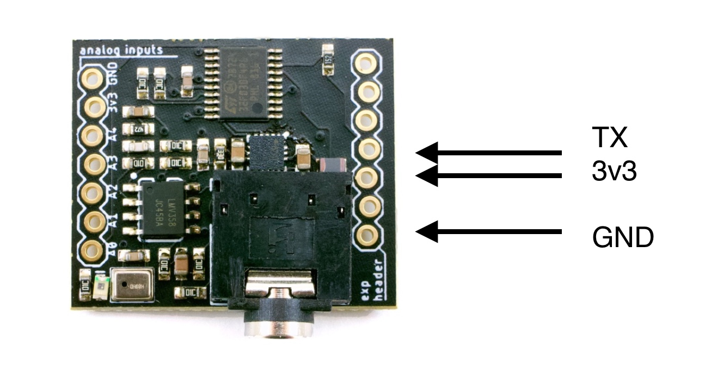

Pixelblaze Sensor Board Library
=======================================

This library lets you use the Pixelblaze Sensor Expansion Board with an Arduino, Teensy, or other microcontroller.

* [Tindie Store](https://www.tindie.com/products/electromage/electromage-pixelblaze-sensor-expansion-board/)
* [Sensor Board Source](https://github.com/simap/pixelblaze_sensor_board)

The Pixelblaze Sensor Board is an add-on sensor board packed with sensors and a dedicated processor.

* A line-in jack and microphone (switches automatically), dedicated signal processing with frequency data ranging from 37Hz-10KHz designed to work in loud environments
* A 3-axis 16G accelerometer
* An ambient light sensor
* 5 analog inputs that can be used with potentiometers or other analog inputs

## Wiring The Sensor Board to an Arduino



Give the sensor board power, and connect it's TX line to an available serial port RX on your board. Be sure to give it only 3.3V, it is not 5V compatible.

For best results, use one of the second+ serial ports available on modern boards. These are usually named `Serial1`, `Serial2`, etc.

If you use a Teensy 3.x, or an ESP8266 based board, examples are provided that process data in the background using interrupts.

Older Arduinos only have a single serial port, and it is usually connected to a USB serial adapter. In this case, use the SoftwareSerial example.

## Library API

### `PixelblazeSensorBoard(Stream &source)`
The constructor accepts a Stream, any Serial can be used, but another kind of Stream could be used too.

Example:

```c++
PixelblazeSensorBoard sensorBoard(Serial1);
```

### `bool readNextFrame()`

If any data is available, a frame is read. It will wait for the rest of the frame if necessary. This usually takes 8-9ms. If no data frame has started, it will return immediately. True is returned when a frame has been read.

```
if (sensorBoard.readNextFrame()) {
  //do stuff
}
```

### `readAvailable()`
Reads any data available on the stream, but will not wait. Useful for use in interrrupts. 

### `uint16_t frequencyData(int index)`
Gets one of the frequencyData buckets 0-31. There are 32 in total, covering 37Hz-10KHz. See [this post](https://forum.electromage.com/t/frequency-buckets/40/2?u=wizard) with information about which frequencies each bucket corresponds to.

### `uint16_t energyAverage()`
Gets the total audio energy across the spectrum. Simular to a VU meter, the louder the higher.

### `uint16_t maxFrequency()`
The loudest frequency is detected, with resolution of about 39Hz. 

### `uint16_t maxFrequencyMagnitude()`
The loudest frequency's magnitude.

### `int16_t accelerometerX()`
### `int16_t accelerometerY()`
### `int16_t accelerometerZ()`
### `uint16_t light()`
### `uint16_t analogInput(int index)`
Gives the reading from one of the analog inputs: 0-4. 

### `unsigned long dataAgeMillis()`
Reports the milliseconds since the last frame was received.


